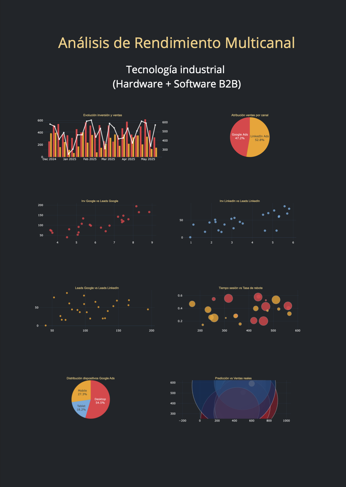

# 🧠 Análisis del Funnel Digital y Predicción de Ventas (B2C)

Este proyecto analiza el comportamiento del funnel digital de un ecommerce, desde sesiones hasta ingresos, segmenta usuarios mediante clustering, y aplica un modelo predictivo para estimar la asistencia a eventos deportivos.

  
  
  

## 📊 Objetivos

- Evaluar el rendimiento diario del funnel: sesiones, compras, conversión e ingresos.
- Analizar ingresos por producto y comportamiento agregado.
- Identificar segmentos de usuarios (clustering).
- Construir un modelo de predicción de asistencia a eventos.
- Presentar los insights clave de forma visual y ejecutiva.

## 🛠️ Herramientas Utilizadas

| Herramienta      | Uso principal                                      |
|------------------|----------------------------------------------------|
| `Python`         | Cálculos, modelado y procesamiento de datos       |
| `Pandas`         | Manipulación de DataFrames                         |
| `Plotly`         | Visualizaciones interactivas premium               |
| `Seaborn / Matplotlib` | Análisis exploratorio (EDA)                   |
| `Scikit-learn`   | Clustering (KMeans), PCA, regresión (RandomForest) |

## 📈 Análisis Realizado

### 🔹 Funnel Diario
- Sesiones, conversiones, ingresos y revenue por sesión.
- Evolución temporal.
- Visualización oscura profesional con títulos en amarillo.

### 🔹 Productos
- Ingresos por producto.
- Gráfico stacked (Top 6 + Otros) con paleta azul suave.
- Ranking de productos más vendidos.

### 🔹 Clustering de Usuarios
- Segmentación basada en edad, sesiones, valor medio del carrito, compras e ingresos.
- Visualizado con PCA (Plotly) y Pairplot (Seaborn).
- 4 clusters claramente diferenciados.

### 🔹 Predicción de Asistencia
- Modelo Random Forest.
- Comparación visual entre valores reales y predichos.
- R² destacado gráficamente.

## 🧠 Autor

- **Aithor** – Consultor de datos especializado en analítica avanzada, Power BI y visualización de datos aplicados al deporte y  ecommerce.

---

